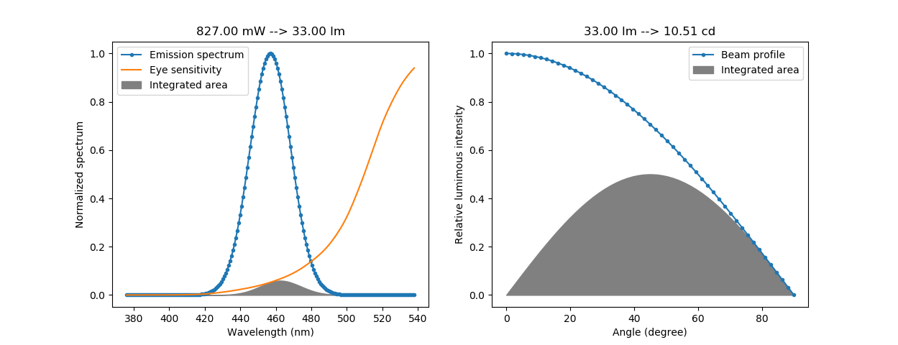

# photometry-converter
Converts between photometric and radiometric units. Supports luminous intensity (in candela), lumious flux (in lumen) and radiant flux/optical power (in milliwatt). Takes into account the spectral emission and beam profile of a light source. See [labsphere technical guide](https://www.labsphere.com/site/assets/files/2570/the-radiometry-of-light-emitting-diodes-leds.pdf) for details about the theory.

### Installation
```
$ git clone https://github.com/andibarg/photometry-converter.git
$ cd photometry-converter
```

### Usage
The following example code converts from milliwatt to lumen to candela. The spectrum is a gaussian peak around 457 nm with a bandwith of 27 nm. The beam profile is according to Lambert's cosing law.
```
import photometry_converter as pc

mW = 827
specdata = pc.gauss_emission(cwvl=457,sbw=27)
beamdata = pc.lambert()

lm = pc.mW2lm(mW, specdata)
cd = pc.lm2cd(lm, beamdata)
```
Alternatively, you can create a class instance. In the following example the beam profile is specified via the apexangle:
```
import photometry_converter as pc

led = pc.source(name = 'Blue LED',
                mW = 827,
                specdata = pc.gauss_emission(cwvl=457,sbw=27),
                apexangle = 120)
led.mW2lm()
led.lm2cd()

led.lm
led.cd
```
The example conversion above may be complemented by the following figures, which show the emission spectrum and the beam profile of the light source:

